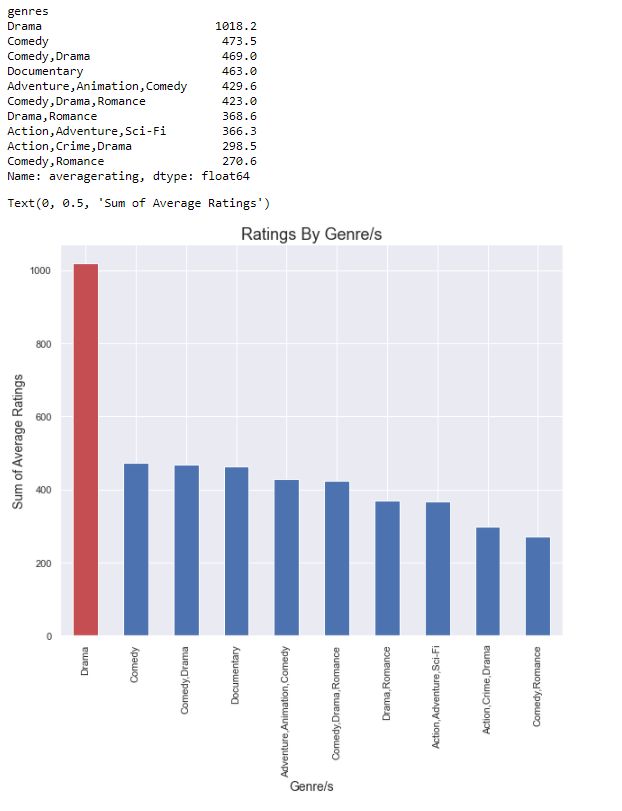
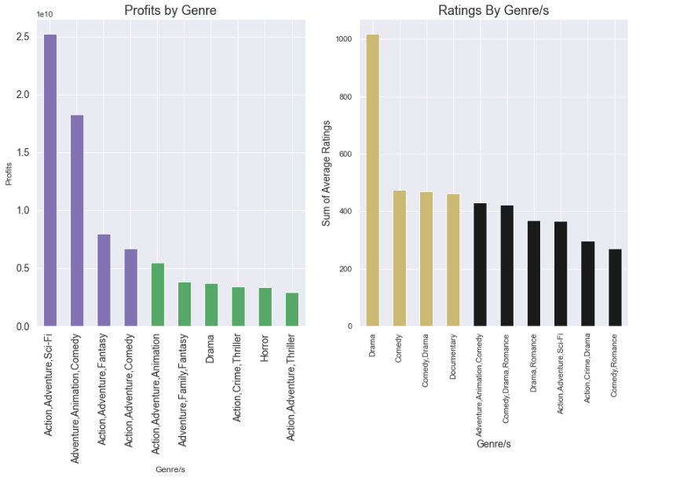

# Project Description:

For this project, I will analyze movie data to come up with the best recommendations for Microsoft's new movie studio. I will use the data to create insights that can be used to increase the likelihood of a successful start. 

## Data

**In the folder 'zippedData' from 2 different sources:**
* IMDB
* TN Movie Budgets

**From these soucres I used a few datasets to make the necessary insights:**
* tn.movie_budgets.csv.gz
* imdb.title.ratings.csv.gz
* imdb.title.basics.csv.gz

With sqlite3 I was able to combine all of the datasets into one dataframe. For ease of use.

# Key Insights

## What is the most popular genre?

Looking at the ratings for different genre can give us an idea of what people like. That way you can build loyalty by giving people what they want. Below I analyzed the most popular genres within the movie database. I looked at the average rating for each movie and grouped them by genre. I took the sum of those ratings to get my results below. 

My first thought was "Wow, Drama is really high compared to the other genres." So i decided to dig a bit further to see if there was a reason.

**There Was**

I found some movies that were duplicated when I searched the dataframe. The movies were had different genres which can skewed our data. I used a method that removes the duplicates. With more time I can research to make sure the movie I kept had the right genre listed. 

### Insights/Findings/Recommendations

**Findings**

After examining all 2785 movies in the dataset. I created a datatframe that shows the count of all the unique genres and and the sum of their average ratings. After after removing the duplicates, Drama still trump over the other genres. It even appeared with other genres on the list. So my guess is that people love a bit of drama in their movies.

**Recommendations**

1. Since 90% of popular movies focus on more than one genre, so should we. 
2. Release movies that has genre dealing with Drama, whether alone or paired with another like Comedy or Romance. 

## What is the highest profit between selected genres?

**Before I look at the comparsion of profits by genre. I want to check if there's a positive correlation between popular and revenue. Does higher rating mean higher revenue?**

So it looks like there a small, but positive correlation between popularity and revenue. Looking at the graph there's a majority of movies making money that have a rating between 6 and 8. So a movie doesn't have to be a perfect 10 to make money, but it's better to keep it over a rating of 6.

**Next I wanted to see quickly compare the top profitable genres with popular genres. Then I compared them side by side in hopes of finding some similarities.**

### Findings/Recommendations

**Findings**

Looking at the charts you can see there are only a few similarities. Even though Drama is high in popularity the profits are a bit on low side. Good thing Action/Adventure/Sci-Fi and Adventure/Animation/Comedy are the top two in regards of earnings, and still have a good amount of popularity to work with. It's best not to lean too heavy on Drama genres, since it's not a real moneymaker.

**Recommnedations**
* I still think it's best to work with the most popular genres, right now, just to build a brand before branching out.
* Right now working with Drama, Action/Adventure/Sci-Fi and Adventure/Animation/Comedy is the best bet.

## What is the return of investment for selected genres?

Since we're sticking with poplarity lets check the fiance from another angle. This can give us an idea of what to invest in. This way we can see which genre gives us the bang for our buck. Let's analyze the return of investment(roi) for each popular genre.

### Findings/Recommendations

**Findings**

* So Drama still seems like the best way to go being the highest in ratings and in return of investments between the most popular genres. Though it seems that even some of the most popular genres have a lower roi than the least popular. With Action/Adventure/Sci-Fi and Adventure/Animation/Comedy, our most profitable genres, coming right behind. 

**Recommendations**
* Investing with Drama genres will guarantee a better return. Action/Adventure/Sci-Fi and Adventure/Animation/Comedy are great investments as well as proftiable. So a win-win situation there. 
* We should start with a few genres to get our toes wet. For then next analysis let's focus on the top four.

## What is the best time to release selected genres?

Picking the time to release a film is crucial to profits. It's a fact people are more adventurous in warmer months, so adventure is a great genre during that time. While others like to cozy up in the colder months, and what better way to cozy up then with a great dramatic movie. Now with a list of four genres the next step is to figure out the best time to release the films. Below you can see each genre and the profits for each month.

### Findings/Recommendations

**Findings**

All around these genres look promising in the month of June. The highest for each genre:
        Drama in Novemeber
        Adventure/Animation/Comedy in July
        Action/Adventure/Sci-Fi in May
        Drama/Romance in February(shocker, right?)
        
**Recommendations**
1. Drama movies will be great for June, July, and November.
2. Adventure,Animation,Comedy will be great for June/July releases.
3. Action,Adventure,Sci-Fi will be great for May/June releases.
4. Drama,Romance will be great for February/June releases.

# Conclusions

**Recommendations**
* Focus on Drama movies for the highest rating. Ratings are important to create loyal customers. Lower rating movies don't get a second glance.
* For profit add Adventure/Animation/Comedy and Action/Adventure/Sci-Fi, though the ratings is fair these genres bring in the most profit. Profits that help build a better studio.
* All movies with these genres should have a summer release. Drama/Romance should focus on more releases in February and Drama in November.

**Next Steps**
* More in-depth statistical analysis to better understand the trends
* Attempt to gather more genre and ratings data as many movies was missing values.
* Focus on production cost for each genre and invest in people to create these films
